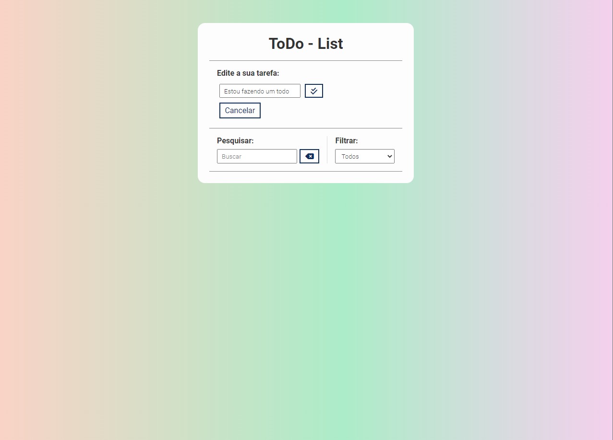

# Projeto todo-list 1.0

## Stack

-   Html
-   Css
-   Javascript

## Resumo

Este é um projeto de lista de tarefas, onde o usuário poderá adicionar as tarefas, editar e excluílas. Também pode marcar quando as tarefas forem concluídas.
A primeira versão consta com o front-end dinamico.

 

